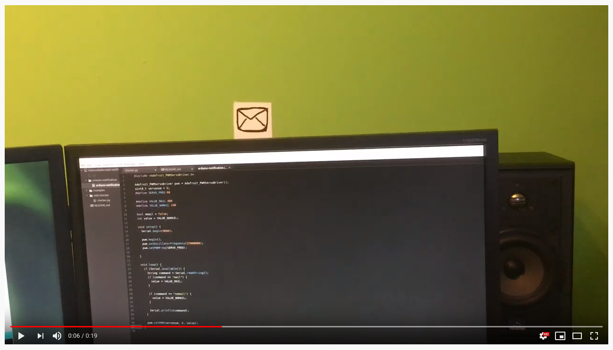

# Arduino Notification

This application listens on serial port for one of the commands: 'mail' or 'nomail' and sets the servo position sets to a different value depending on the command.

I use it to show envelope icon drawn on a piece of cardboard when I have unread messages on my mailbox.

# Mail Checker

Usage:

`python3 checker.py [-h] [--serial-port SERIAL_PORT] [--imap-server IMAP_SERVER] --imap-user IMAP_USER`

--serial-port - serial port to send data to arduino, default: /dev/ttyUSB0
--imap-server - imap server, default: imap.gmail.com
--imap-user - imap account name, for example: john.doe@gmail.com, required

This application checks if there are unread messages on mailbox and sends 'mail' or 'nomail' string on serial port.

## GMail security.

To access Gmail account from a custom application like this one, you'll need to allow access from "Less Secure Apps" at https://myaccount.google.com/lesssecureapps

# Examples

[[PL] Artykuł na blogu](https://programisty-dzien-powszedni.pl/powiadamianie-o-nowej-poczcie-z-arduino)
